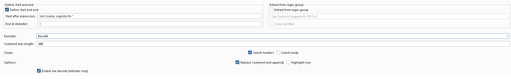
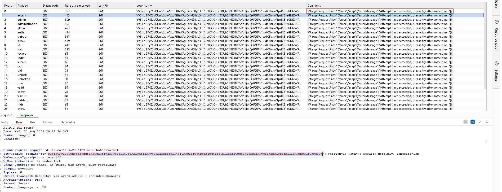

# BurpInlineDecoder

**BurpInlineDecoder** is a Burp Suite extension that extracts and decodes values from HTTP responses **during Intruder attacks** and writes the result into the **Comment** column—so you can sort, grep, and reason about responses without leaving the Intruder UI.

It mirrors the familiar *Grep – Extract* experience: choose **between delimiters** *or* a **regex capture group**, then pick a decoder (Base64, URL-safe Base64, Hex → Text, URL decode, Gzip/Deflate, JWT header+payload, JSON pretty).

<p align="center">
  
</p>

<p align="center">
  
</p>

---

## Features

- 📌 **Inline decode into Intruder**: results show up in **Comment**, right next to payload/length/status.
- 🎯 **Two extraction modes** (mutually exclusive, like Grep-Extract):
  - **Between delimiters**: *Start after* / *End at*.
  - **Regex group**: your regex; the first capturing group is extracted.
- 🧰 **Decoders included**
  - Auto (Base64), Base64, Base64 (URL-safe)
  - Hex → Text, URL-decode
  - Gzip/Deflate (zlib & gzip heuristics)
  - JWT header + payload (pretty-printed JSON)
  - JSON pretty
- 🧹 **Input sanitization** for Base64/Hex (pads/normalizes common cases).
- ✍️ **Comment control**: *Replace Comment (not append)* or append to existing comments.
- 🎨 **Optional row highlight** for quick visual scanning.
- 💾 **Settings persist** across Burp sessions.

---

## Compatibility

- Burp Suite Professional / Community
- Jython (Burp → Extender → Options → Python Environment)
- Tested with Jython 2.7.x

---

## Installation

1. Install **Jython** and point Burp to the JAR (Burp → **Extender** → **Options** → Python Environment).
2. Clone this repository:
   ```bash
   git clone https://github.com/AI-Pentest/BurpInlineDecoder.git
   cd BurpInlineDecoder
   ```
3. In Burp, go to **Extender → Extensions → Add**:
   - **Extension type**: Python
   - **Extension file**: `BurpInlineDecoder.py`

---

## Usage

1. Choose **one** extraction mode:
   - **Define start and end** (between delimiters), **or**
   - **Extract from regex group** (first capturing group).
   > Only one can be active at a time. Toggling one disables the other.

2. Pick a **Decoder** (e.g., Auto Base64).  
   - “Auto (Base64)” tries standard Base64 first, then URL-safe Base64.
   - “Hex → Text” strips non-hex chars so you can paste mixed input.
   - “Gzip/Deflate” tries gzip (with header) then raw/zlib deflate.
   - “JWT header+payload” pretty-prints the first two JWT parts.
   - “JSON pretty” pretty-prints valid JSON strings.

3. Scope options:
   - **Search headers** and/or **Search body**.

4. Options:
   - **Replace Comment (not append)**: overwrite Comment instead of appending.
   - **Highlight row**: set a color on matching rows.

5. Run Intruder. Decoded values will show in the **Comment** column.  
   Use the “Comment max length” option to cap the output length if needed.

---

## Tips

- **Sanitize/padding**: Base64/URL-safe is tolerant of missing `=` padding and surrounding quotes.
- **JWT**: You can grep out tokens with regex and use **JWT header+payload** to preview contents without a key.
- **Large blobs**: For huge values (e.g., compressed JSON), enable **Gzip/Deflate** and adjust the comment length.
- **Append vs Replace**:  
  - *Append* lets you keep manual notes or multiple decodes per row.  
  - *Replace* keeps the Comment field clean and deterministic for sorting/filters.

---

## Screenshots

- `assets/ui-compact.png` — compact, top-anchored configuration panel.
- `assets/intruder-results.png` — decoded output inline in Intruder results.

> If you fork/rename, update the paths or use absolute links for GitHub’s image viewer.

---

## Troubleshooting

- **“decode error: Incorrect padding”**: use *Auto (Base64)* or *Base64 (URL-safe)*; padding is auto-fixed for most inputs.
- **No output**: confirm one extraction mode is enabled and the text actually matches in headers/body (toggle scope).
- **Both modes checked**: by design they’re mutually exclusive; enabling one disables the other.
- **Gzip/Deflate**: some servers double-encode; try URL-decode → Gzip/Deflate by extracting the compressed blob directly.

---

## Development

Main file: `BurpInlineDecoder.py`  
Key components:
- UI tab (`GrepXTab`) with Grep-Extract-style panels (mutually exclusive).
- `LiveDecoder` (IHttpListener) injects decoded values into **Comment** during Intruder responses.
- Decoders & sanitizers: Base64/URL-safe, Hex, URL decode, Deflate/Gzip, JWT, JSON pretty.

> The extension currently targets Intruder responses only (by design). PRs welcome for additional tools.

---

## License

MIT — see [LICENSE](LICENSE).

